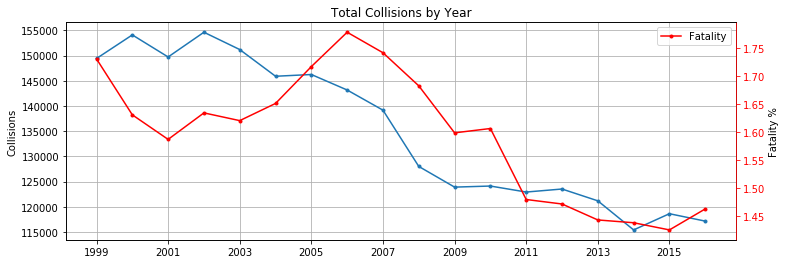
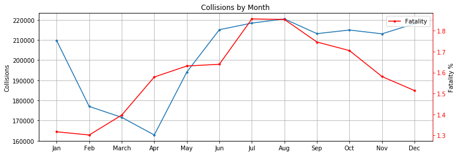
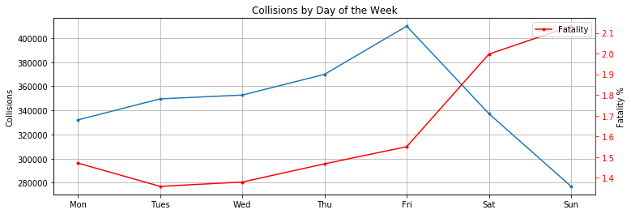
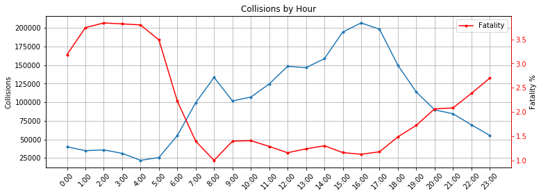
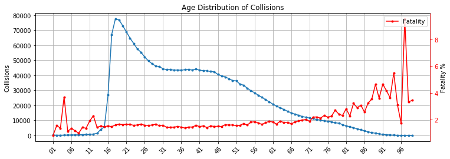
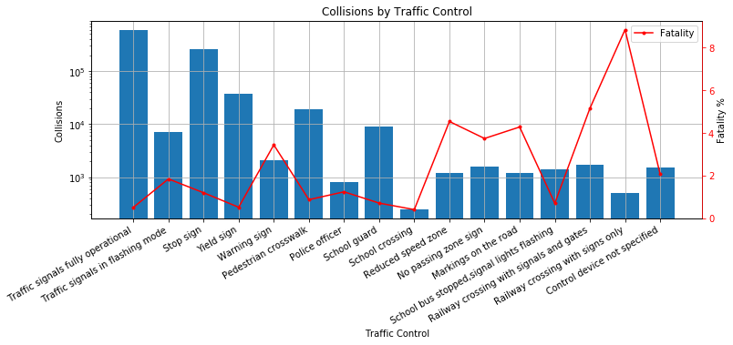
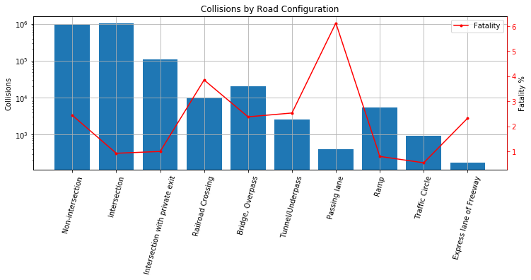
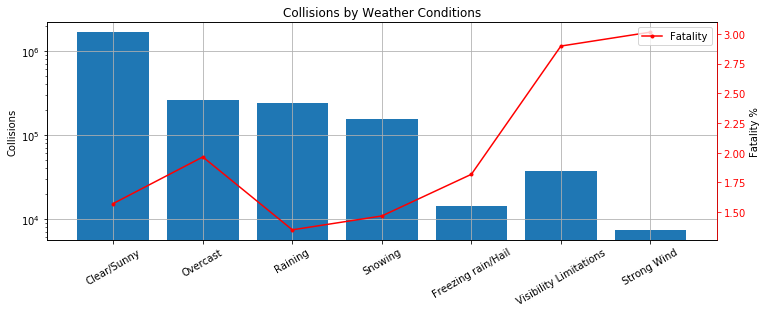
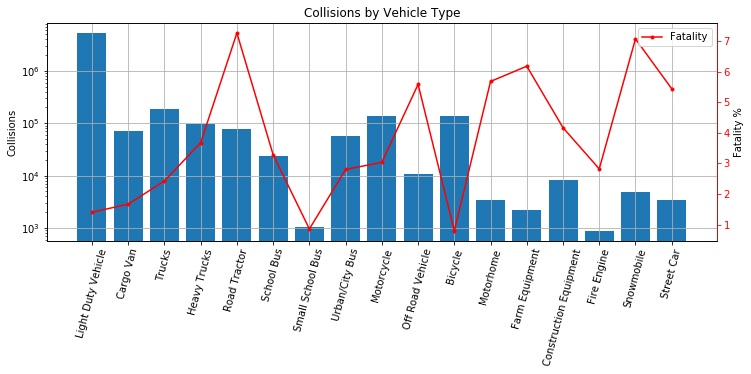
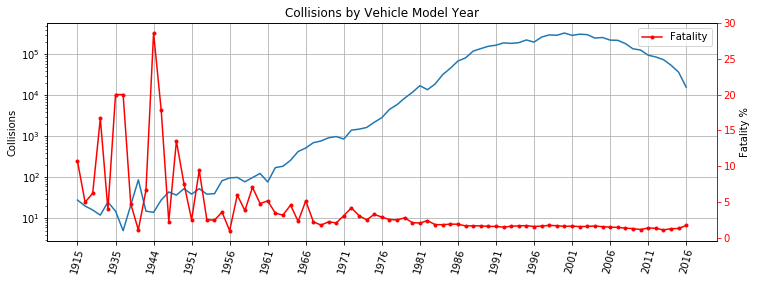

## by: Spencer Gray

# Canadian National Collision Database Analysis

__source:__ _Transport Canada - National Collision Database (NCDB)_ https://open.canada.ca/data/en/dataset/1eb9eba7-71d1-4b30-9fb1-30cbdab7e63a

The National Collision Database contains all police-reported public road motor vehicle collisions in Canada occuring between 1999-2016.

## Introduction

In this project I am analyzing vehicle collisions occuring in Canada between 1999-2016 to hopefully identify safer driving situations. In this day, if a Canadian lives outside of the city, a vehicle is pretty much mandatory to get anywhere. Observing collision analytics is important to identify dangerous patterns in hopes to provide safer roads to the public. We can observe circumstances that should be avoided or even facilitate means to improve that statistic over time, such as employing more police officers at certain times, or implementing different traffic configurations in our newly developed roads. Vehicles are becoming safer as technology inovations continue to flourish but there are still many dangers associated with vehicles - so let's get to exploring the data.

The following information is recorded for each collisions:
- C_Year: Collision Year
- C_Month: Collision Month
- C_WDAY: Day of the Week
- C_SEV: Collision Severity
- C_VEHS: Number of Vehicles Involved
- C_RCFG: Roadway Configuration
- C_WTHR: Weather Condition
- C_RSUR: Road Surface
- C_RALN: Road Alignment
- C_TRAF: Traffic Control


- V_ID: Vehicle Sequence Number
- V_TYPE: Vehicle Type (Manufacturer)
- V_YEAR: Vehicle Model Year


- P_ID: Person Sequence Number
- P_SEX: Person Sex
- P_AGE: Person Age
- P_PSN: Person Position
- P_ISEV: Medical Assistance Required
- P_SAFE: Safety Device Used
- P_USER: Road User Class


- C_Case: Collision Case Number


```python
import pandas as pd
import numpy as np
import matplotlib.pyplot as plt
%matplotlib inline
```

Reading in data, storing inside collisionData variable.


```python
collisionData = pd.read_csv("NCDB_1999_to_2016.csv", low_memory=False)
```

Finding the size of the dataset by utilizing the shape function.


```python
collisionData.shape
```


    (6486831, 23)


The original dataset is very large with a total of 6,486,831 rows and 23 columns in the dataset.

Clearing the dataset month, weekday, and hour columns of unknown entries U, UU, and XX.
Even though there are a lot of other positions with unknown values I didn't want to remove too much from the original dataset, especially considering the data is still usable in most situations.


```python
df = collisionData[:]
df[['C_MNTH', 'C_WDAY', 'C_HOUR']] = df[['C_MNTH', 'C_WDAY', 'C_HOUR']].replace('[^0-9]+', np.nan, regex=True)
df.dropna(axis=0, subset=['C_MNTH', 'C_WDAY', 'C_HOUR'], inplace=True)
df.shape
```


    (6421840, 23)


A total of 64,991 unknown rows were removed from the dataset and the remaining are stored in a new DataFrame to use, df. After cleaning were left with 6,421,840 rows.

We also need to take note of the 'C_CASE' column which represents the collision case number it was filed under by the police. Some of these values are repeated meaning there are duplicated collisions in the dataframe. These need to be cleaned up to avoid the same data being processed multiple times. 
I'm creating a new dataframe, df2, to handle this since df might be viable for tests performed later.


```python
df2 = df.drop_duplicates(subset=['C_CASE'], keep='first')
df2.shape
```


    (2428419, 23)


Now we can see there are 2,428,419 total rows. This means that between 1999-2016 there have been 2,428,419 unique collisions reported by the police across Canada.

## 1) Analysing risks of collision by different Years/Months/Weekdays/Times

### a) Observing Collisions by Year

Looking how collision numbers have changed over the years and hopefully identify an increase in vehicle safety over time.
- The number of deaths and collisions occuring in each day of the week are found and stored inside a ratioYear dataframe.
- Plotting (ax1): a line chart representing total collisions of the years.
- Plotting (ax2): a line chart of percent chance of a fatality occuring.


```python
yearlyDeaths = df2.query('C_SEV==1')['C_YEAR'].value_counts().sort_index()

lifespanTot = df2['C_YEAR'].value_counts().sort_index()

plt.figure(figsize=(12,4))

ratioYear = pd.DataFrame(columns=['Deaths', 'Total'])
ratioYear['Deaths'] = yearlyDeaths
ratioYear['Total'] = lifespanTot
ratioYear.index = yearlyDeaths.index

ax1 = plt.gca()
ax1.plot(lifespanTot.index, lifespanTot, marker='.')
ax1.set_ylabel('Collisions')
ax1.set_title('Total Collisions by Year')

ax2 = ax1.twinx()
ax2.plot(yearlyDeaths.index, (ratioYear['Deaths']/ratioYear['Total'])*100, label='Death Ratio', color='r', marker='.')
ax2.set_ylabel('Fatality %')
ax2.spines['right'].set_color('red')
ax2.tick_params(axis='y', colors='red')

plt.xticks(lifespanTot.index[::2])
ax1.grid(axis='both')
plt.legend(['Fatality'], loc='upper right')

plt.show()
```





__Conclusion:__

There has been a steady decline in the total number of collisions over the years. More-so then mechanical improvements, the growing increase in technology being added to vehicles; such as blind spot monitoring, driver alertness detection, 360 cameras are proving to be impactful in vehicle safety. Though there was a rise in fatality rates from 2003 until peaking in 2007, it has been steadily decreasing since. The lowest chance of fatality in a year was 2015.

### b) Observing Collisions by Month

I will be plotting both the frequencies of collisions and the chance of it being a fatality. The number of deaths and collisions occuring in each month are found and stored inside a ratioMonth dataframe. We plot both graphs on one plot, the bar graph representing total collision count while the line graph is number of fatalities divided by total collisions.


```python
monthlyDeaths = df2.query('C_SEV==1')['C_MNTH'].value_counts().sort_index()
monthlyDeaths.index = ['Jan', 'Feb', 'March', 'Apr', 'May', 'Jun', 'Jul', 'Aug', 'Sep', 'Oct', 'Nov', 'Dec']

plt.figure(figsize=(12,4))

monthlyTot = df2['C_MNTH'].value_counts().sort_index()
monthlyTot.index = monthlyDeaths.index

ratioMonth = pd.DataFrame(columns=['Deaths', 'Total'])
ratioMonth['Deaths'] = monthlyDeaths
ratioMonth['Total'] = monthlyTot
ratioMonth.index = monthlyDeaths.index

fig1 = plt.figure(1)
ax1 = plt.gca()
ax1.plot(monthlyTot.index, monthlyTot, marker='.')
ax1.set_ylabel('Collisions')
ax1.set_title('Collisions by Month')
ax1.grid(axis='both')

ax2 = ax1.twinx()
ax2.plot(monthlyDeaths.index, (ratioMonth['Deaths']/ratioMonth['Total'])*100, label='Death Ratio', color='r', marker='.')
ax2.set_ylabel('Fatality %')
ax2.spines['right'].set_color('red')
ax2.tick_params(axis='y', colors='red')
plt.legend(['Fatality'], loc='upper right')


plt.show()
```





__Conclusion:__

The least amount of collisions occurs during the months April with the lowest chance of fatality when involved in a collision occuring in Febuary. There is a slight increase in the amount of collisions occuring during the Summer months with a peak in July and August. There is also a peak in chance of fatalities when involved in a collision during these two months.

### c) Observing Collisions by Weekday

Now I will be plotting both the frequencies of collisions and the chance of it being a fatality for weekdays.
- The number of deaths and collisions occuring in each day of the week are found and stored inside a ratioWday dataframe.
- Plotting (ax1): a line chart representing total collisions of the week.
- Plotting (ax2): a line chart of percent chance of a fatality occuring.


```python
weekdayDeaths = df2.query('C_SEV==1')['C_WDAY'].value_counts().sort_index()
weekdayDeaths.index = ['Mon', 'Tues', 'Wed', 'Thu', 'Fri', 'Sat', 'Sun']

weekdayTot = df2['C_WDAY'].value_counts().sort_index()
weekdayTot.index = ['Mon', 'Tues', 'Wed', 'Thu', 'Fri', 'Sat', 'Sun']

plt.figure(figsize=(12,4))

ratioWday = pd.DataFrame(columns=['Deaths', 'Total'])
ratioWday['Deaths'] = weekdayDeaths
ratioWday['Total'] = weekdayTot
ratioWday.index = ['Mon', 'Tues', 'Wed', 'Thu', 'Fri', 'Sat', 'Sun']

ax1 = plt.gca()
ax1.plot(weekdayTot.index, weekdayTot, marker='.')
ax1.set_ylabel('Collisions')
ax1.grid(axis='both')

ax2 = ax1.twinx()
ax2.plot(ratioWday.index, (ratioWday['Deaths']/ratioWday['Total'])*100, label='Death Ratio', color='r', marker='.')
ax2.set_ylabel('Fatality %')
ax2.spines['right'].set_color('red')
ax2.tick_params(axis='y', colors='red')
plt.title('Collisions by Day of the Week')
plt.legend(['Fatality'], loc='upper right')


plt.show()
```





__Conclusion:__

The lowest amount of collisions occur on Sunday, however, it is also the most dangerous day to get involved a an accident with the chance of fatality at 2.17%.
Tuesday and Wednesday are the safest days to get into an accident. Friday has the highest rate of collisions.


### d) Observing Collisions by Time of Day

Gathering time of day parameters, frequencies of collisions and chance of fatality.
- The number of deaths and collisions occuring in each day of the week are found and stored inside a ratioHour dataframe.
- Storing the collision/fatality counts of different times of day and sorting by index.
- Setting index to times of day (24-hour clock).
- Plotting (ax1): a line chart representing total collisions of the day.
- Plotting (ax2): a line chart of percent chance of a fatality occuring.


```python
hourDeaths = df2.query('C_SEV==1')['C_HOUR'].value_counts().sort_index()
hourDeaths.index = ['0:00', '1:00', '2:00', '3:00', '4:00', '5:00', '6:00', '7:00', '8:00',
                '9:00', '10:00', '11:00', '12:00', '13:00', '14:00', '15:00', '16:00', '17:00', '18:00',
                '19:00', '20:00', '21:00', '22:00', '23:00']

dayPlot = df2['C_HOUR'].value_counts().sort_index()
dayPlot.index = hourDeaths.index

plt.figure(figsize=(12,4))

ratioHour = pd.DataFrame(columns=['Deaths', 'Total'])
ratioHour['Deaths'] = hourDeaths
ratioHour['Total'] = dayPlot

plt.xticks(rotation=45)

ax1 = plt.gca()
ax1.plot(dayPlot.index, dayPlot, marker='.')
ax1.set_ylabel('Collisions')
ax1.grid(axis='both')

ax2 = ax1.twinx()
ax2.plot(ratioHour.index, (ratioHour['Deaths']/ratioHour['Total'])*100, label='Death Ratio', color='r', marker='.')
ax2.set_ylabel('Fatality %')
ax2.spines['right'].set_color('red')
ax2.tick_params(axis='y', colors='red')
plt.title('Collisions by Hour')
plt.legend(['Fatality'], loc='upper right')

plt.show()
```





__Conclusion:__

Collisions are occuring much more frequently in the day with a peak during the hours of 3pm and 5pm. At night there is a significant drop-off with the lowest amount of collisions occuring between 4am and 5am. Interestingly, the opposite occurs with chance of a fatality per collision as there is a substantial increase during night/early morning times. At a peak time period between 1:00am to 5:00am there is a peak 3.84% chance of fatality. Compared to the daily low of 1.00%, at 8:00am, that is a 284% increase in chance that a fatality will occur in just a few hours.

## 2) Viewing Collisions Distributions in Age and Genders

### a) Age Distribution

In this section we are observing the age distribution of collisions.
- ratioAge dataframe will hold our isolated data to be used for plotting.
- Need to drop the unknowns 'UU', 'NN'. The unkown information is not relevant to us.
- Plotting (ax1): a line chart representing total collisions an age group is involved in.
- Plotting (ax2): a line chart of percent chance of a fatality occuring.


```python
ageDeaths = df2.query('C_SEV==1')['P_AGE'].value_counts().sort_index()

ageTotal = df2['P_AGE'].value_counts().sort_index()

plt.figure(figsize=(12,4))

ratioAge = pd.DataFrame(columns=['Deaths', 'Total'])
ratioAge['Deaths'] = ageDeaths
ratioAge['Total'] = ageTotal

ratioAge = ratioAge.drop(['UU', 'NN'])

plt.xticks(rotation=45)

ax1 = plt.gca()
ax1.plot(ratioAge.index, ratioAge['Total'], marker='.')
ax1.set_ylabel('Collisions')
ax1.grid(axis='both')

ax2 = ax1.twinx()
ax2.plot(ratioAge.index, (ratioAge['Deaths']/ratioAge['Total'])*100, label='Death Ratio', color='r', marker='.')
ax2.set_ylabel('Fatality %')
ax2.spines['right'].set_color('red')
ax2.tick_params(axis='y', colors='red')
plt.title('Age Distribution of Collisions')
plt.xticks(ratioAge.index[::5])
plt.legend(['Fatality'], loc='upper right')

plt.show()
```





__Conclusion:__

From birth to the age of 19 there is an almost perfect exponential increase in the amount of collisions an age is involved in. After the age of 19 there is a gradual decline in collisions, leveling off in years 32 to 45, then continuing a gradual decline until death.

The fatality rates spiking in early years is very surprising. At the age of 4, the chance of fatality when in a collision is 3.70%. One reason could be that parents think there child has out grown children vehicle seats not realizing they are greatly increasing the risk of their child if a collision were to take place. Outside of the early years, fatality rates increase at gradual rate until the age of 75. After the age of 75, drivers risk of fatality starts to increase at a much faster rate.

### b) Gender Differences

Creating a dataframe to examine gender differences involving collisions. Exploring the death ratio's as well as the probabilitiers of each occuring in the whole dataset.
- The number of deaths and collisions occuring for each gender are stored inside ratioGender dataframe.
- Drop unknown values 'N', 'U', only interested in the two genders.
- Create columns 'Death/Total', 'P(collisions', 'P(fatality)' and fill with their calculated results.
- Display the dataframe for observations/analysis.


```python
genderDeaths = df2.query('C_SEV==1')['P_SEX'].value_counts().sort_index()

genderTotal = df2['P_SEX'].value_counts().sort_index()

ratioGender = pd.DataFrame(columns=['Deaths', 'Total'])
ratioGender['Deaths'] = genderDeaths
ratioGender['Total'] = genderTotal

ratioGender = ratioGender.drop(['N', 'U'])

ratioGender['Death/Total'] = (ratioGender['Deaths']/ratioGender['Total'])*100
ratioGender['P(collision)'] = (ratioGender['Total']/2428419)*100
ratioGender['P(fatality)'] = (ratioGender['Deaths']/2428419)*100

ratioGender
```


<div>
<style scoped>
    .dataframe tbody tr th:only-of-type {
        vertical-align: middle;
    }

    .dataframe tbody tr th {
        vertical-align: top;
    }

    .dataframe thead th {
        text-align: right;
    }
</style>
<table border="1" class="dataframe">
  <thead>
    <tr style="text-align: right;">
      <th></th>
      <th>Deaths</th>
      <th>Total</th>
      <th>Death/Total</th>
      <th>P(collision)</th>
      <th>P(fatality)</th>
    </tr>
  </thead>
  <tbody>
    <tr>
      <th>F</th>
      <td>8253</td>
      <td>868407</td>
      <td>0.950361</td>
      <td>35.760180</td>
      <td>0.339851</td>
    </tr>
    <tr>
      <th>M</th>
      <td>29843</td>
      <td>1472546</td>
      <td>2.026626</td>
      <td>60.638053</td>
      <td>1.228907</td>
    </tr>
  </tbody>
</table>
</div>


The difference between men and women involving collisions is quite substantial. The probability of men being involved in a collision is 60.64%, compared to a 35.76% chance of women involvment. If a male does get in an accident there is a 2.03% chance a fatality will occur versus a 0.95% chance if women. It's clear that women are safer drivers; not only are they associated with accidents less, there's also far less likely a chance a fatality occurs when their involved.

## 3) Different Conditions and Impact on Chance of Collision

### a) Traffic Control Collision Observation

Examining different traffic controls and the frequencies of collisions, probabilities and chance of fatalities occuring.
- I use a dataframe (ratioTraf) to store the different frequency counts, as well as their probabilities and ratio's.
- Dropping unknowns from the column.
- Since there was such a large discrepancy between total collisions counts the y-axis was scaled by log for easier/cleaner visualization.
- The xticks had to be rotated 30 degrees to avoid overlapping.
- Plotting (ax1): a bar graph representing total collisions of the traffic control types.
- Plotting (ax2): a line chart of percent chance of a fatality occuring.


```python
trafDeaths = df2.query('C_SEV==1')['C_TRAF'].value_counts().sort_index()

traf_names = ['Traffic signals fully operational','Traffic signals in flashing mode',
             'Stop sign','Yield sign','Warning sign','Pedestrian crosswalk',
             'Police officer','School guard','School crossing','Reduced speed zone',
             'No passing zone sign','Markings on the road',
             'School bus stopped,signal lights flashing','Railway crossing with signals and gates',
             'Railway crossing with signs only','Control device not specified','No control present']

trafTot = df2['C_TRAF'].value_counts().sort_index()

plt.figure(figsize=(12,4))

ratioTraf = pd.DataFrame(columns=['Deaths', 'Total'])
ratioTraf['Deaths'] = trafDeaths
ratioTraf['Total'] = trafTot
ratioTraf = ratioTraf.drop(['18', 'QQ', 'UU'])

plt.xticks(rotation=30)

ax1 = plt.gca()
ax1.bar(ratioTraf.index, ratioTraf['Total'])
ax1.set_ylabel('Collisions')
ax1.set_title('Collisions by Traffic Control')
ax1.set_yscale('log')
ax1.grid(axis='both')

ax2 = ax1.twinx()
ax2.plot(ratioTraf.index, (ratioTraf['Deaths']/ratioTraf['Total'])*100, label='Death Ratio', color='r', marker='.')
ax2.set_ylabel('Fatality %')
ax2.spines['right'].set_color('red')
ax2.tick_params(axis='y', colors='red')

ax1.set_xticklabels(traf_names,ha='right')
ax1.set_xlabel('Traffic Control')
plt.legend(['Fatality'], loc='upper right')

plt.show()
```





Since there is such a large discrepancy in two entries; traffic signals fully operational, and stop signs I'm curious the what the proportion of total crashes are responsible for these two configurations.
- Added a probability column in the ratioTraf dataframe to examine.


```python
ratioTraf['Px'] = (ratioTraf['Total']/2428419)*100
ratioTraf = ratioTraf.sort_values(by=['Px'], ascending=False)

ratioTraf['Ratio'] = (ratioTraf['Deaths']/ratioTraf['Total'])*100

ratioTraf.head()
```


<div>
<style scoped>
    .dataframe tbody tr th:only-of-type {
        vertical-align: middle;
    }

    .dataframe tbody tr th {
        vertical-align: top;
    }

    .dataframe thead th {
        text-align: right;
    }
</style>
<table border="1" class="dataframe">
  <thead>
    <tr style="text-align: right;">
      <th></th>
      <th>Deaths</th>
      <th>Total</th>
      <th>Px</th>
      <th>Ratio</th>
    </tr>
  </thead>
  <tbody>
    <tr>
      <th>01</th>
      <td>3089</td>
      <td>605062</td>
      <td>24.915881</td>
      <td>0.510526</td>
    </tr>
    <tr>
      <th>03</th>
      <td>3081</td>
      <td>257023</td>
      <td>10.583964</td>
      <td>1.198725</td>
    </tr>
    <tr>
      <th>04</th>
      <td>191</td>
      <td>36772</td>
      <td>1.514236</td>
      <td>0.519417</td>
    </tr>
    <tr>
      <th>06</th>
      <td>164</td>
      <td>18766</td>
      <td>0.772766</td>
      <td>0.873921</td>
    </tr>
    <tr>
      <th>08</th>
      <td>65</td>
      <td>9123</td>
      <td>0.375677</td>
      <td>0.712485</td>
    </tr>
  </tbody>
</table>
</div>


__Conclusion:__

It's evident that most collisions are occuring at traffic signals with fully operational lights at a whopping 24.92% of all traffic accidents. I found the probability of accidents occuring at stop signs to be quite high as well at 10.58%.
There is a fairly high chance of death occuring when involved in a collision at railway crossings with signs only at 8.84%. When proper warning lights, signals and gates are installed this number falls to 5.15%. This is a 42% reduced chance of dying which is quite significant. We can conclude that railway crossings should be assessed across Canada. Just posting a railroad sign is dangerous as drivers have to visually see the train, which is often obscured, or hear the train coming.

### b) Roadway Configuration

Observing roadway configurations frequencies of collisions.
- I use a dataframe (ratioRcfg) to store the different frequency counts and death ratio's.
- Dropping unknowns 'QQ' and 'UU' rows.
- This is another case with large discrepancies between total collisions so y was scalled by log for easier/cleaner visualization.
- The xticks had to be rotated 75 degrees to avoid overlapping.
- Plotting (ax1): a bar graph representing total collisions of the traffic roadway configurations.
- Plotting (ax2): a line chart of percent chance of a fatality occuring.


```python
rcfgDeaths = df2.query('C_SEV==1')['C_RCFG'].value_counts().sort_index()

rcfgTotal = df2['C_RCFG'].value_counts().sort_index()

plt.figure(figsize=(12,4))

ratioRcfg = pd.DataFrame(columns=['Deaths', 'Total'])
ratioRcfg['Deaths'] = rcfgDeaths
ratioRcfg['Total'] = rcfgTotal
ratioRcfg = ratioRcfg.drop(['QQ', 'UU'])
ratioRcfg.index = ['Non-intersection', 'Intersection', 'Intersection with private exit', 
                   'Railroad Crossing', 'Bridge, Overpass', 'Tunnel/Underpass',
                   'Passing lane', 'Ramp', 'Traffic Circle', 'Express lane of Freeway']

plt.xticks(rotation=75)

ratioRcfg['Ratio'] = (ratioRcfg['Deaths']/ratioRcfg['Total'])*100
           
ax1 = plt.gca()
ax1.bar(ratioRcfg.index, ratioRcfg['Total'])
ax1.set_ylabel('Collisions')
ax1.set_yscale('log')
ax1.grid(axis='both')

ax2 = ax1.twinx()
ax2.plot(ratioRcfg.index, (ratioRcfg['Deaths']/ratioRcfg['Total'])*100, label='Death Ratio', color='r', marker='.')
ax2.set_ylabel('Fatality %')
ax2.spines['right'].set_color('red')
ax2.tick_params(axis='y', colors='red')
plt.title('Collisions by Road Configuration')
plt.legend(['Fatality'], loc='upper right')

plt.show()
```





__Intermediate Results:__

Most collisions are occuring around intersections, however a large amount also occur out on open roads and non-intersections. We can see the spike in fatality percentage when using a passing lane, with a fatality rate of 6.13%. Similarly to traffic control, we can observe that railway crossings are very dangerous areas to get involved in a crash. 

Interestingly, fatalities are least likely to occur inside traffic circles. Let's explore this furthur.


```python
ratioRcfg.head()
```


<div>
<style scoped>
    .dataframe tbody tr th:only-of-type {
        vertical-align: middle;
    }

    .dataframe tbody tr th {
        vertical-align: top;
    }

    .dataframe thead th {
        text-align: right;
    }
</style>
<table border="1" class="dataframe">
  <thead>
    <tr style="text-align: right;">
      <th></th>
      <th>Deaths</th>
      <th>Total</th>
      <th>Ratio</th>
    </tr>
  </thead>
  <tbody>
    <tr>
      <th>Non-intersection</th>
      <td>23056</td>
      <td>944864</td>
      <td>2.440140</td>
    </tr>
    <tr>
      <th>Intersection</th>
      <td>9738</td>
      <td>1054507</td>
      <td>0.923465</td>
    </tr>
    <tr>
      <th>Intersection with private exit</th>
      <td>1099</td>
      <td>110296</td>
      <td>0.996410</td>
    </tr>
    <tr>
      <th>Railroad Crossing</th>
      <td>388</td>
      <td>10072</td>
      <td>3.852264</td>
    </tr>
    <tr>
      <th>Bridge, Overpass</th>
      <td>484</td>
      <td>20338</td>
      <td>2.379782</td>
    </tr>
  </tbody>
</table>
</div>


__Conclusion:__

What's interesting is that collisions involving deaths are almost half as likely to occur at traffic circles then intersections. This could be why Canada has been starting to incorporate traffic circles more in their public roads. They should be incouraged as we have identified them as being a safer alternative to traffic lights and intersections.

### c) Weather Conditions

Looking at how weather conditions effect collisions across Canada.
- dataframe (ratioWthr) stores the different frequency counts and death ratio's.
- Dropping unknown weather entries 'Q' and 'U'.
- Log helps scale the y-axis here to deal with the wide range of collision totals. Makes the graph more presentable.
- xtick rotation helps avoid x-axis overlapping.
- Plotting (ax1): a bar graph representing total collisions of the different weather conditions.
- Plotting (ax2): a line chart of percent chance of a fatality occuring.


```python
wthrDeaths = df2.query('C_SEV==1')['C_WTHR'].value_counts().sort_index()

wthrTotal = df2['C_WTHR'].value_counts().sort_index()

plt.figure(figsize=(12,4))

ratioWthr = pd.DataFrame(columns=['Deaths', 'Total'])
ratioWthr['Deaths'] = wthrDeaths
ratioWthr['Total'] = wthrTotal
ratioWthr = ratioWthr.drop(['Q', 'U'])
ratioWthr.index = ['Clear/Sunny', 'Overcast', 'Raining', 'Snowing', 'Freezing rain/Hail', 
                   'Visibility Limitations', 'Strong Wind']

plt.xticks(rotation=30)
           
ax1 = plt.gca()
ax1.bar(ratioWthr.index, ratioWthr['Total'])
ax1.set_ylabel('Collisions')
ax1.set_yscale('log')
ax1.grid(axis='both')

ax2 = ax1.twinx()
ax2.plot(ratioWthr.index, (ratioWthr['Deaths']/ratioWthr['Total'])*100, label='Death Ratio', color='r', marker='.')
ax2.set_ylabel('Fatality %')
ax2.spines['right'].set_color('red')
ax2.tick_params(axis='y', colors='red')
plt.title('Collisions by Weather Conditions')
plt.legend(['Fatality'], loc='upper right')

plt.show()
```





__Conclusion:__

Not surprisingly, most collisions occur on Clear/Sunny days since it is the most common weather type in Canada and most people are driving during the day. Limited visibility, such as night time or fog increase the chance of a fatality occuring. I found it interesting that strong winds have the highest rates of fatality associated to them even though they are much less prevelant than other types.

## 4) Vehicle Type and Model Year

### a) Vehicle Type

Observing different vehicle types and the different associated risks.
- In this instance a ratioVTYPE dataframe is used to store the different frequency counts and death ratio's.
- Dropping unknowns 'NN', 'QQ' and 'UU' rows.
- Large discrepancies between total collisions, therefore the y-axis was scalled by log for easier/cleaner visualization.
- Plotting (ax1): a bar graph showing the amounts of collisions in each vehicle type.
- Plotting (ax2): a line chart of percent chance of a fatality occuring.


```python
vtypeDeaths = df.query('C_SEV==1')['V_TYPE'].value_counts().sort_index()

vtypeTotal = df['V_TYPE'].value_counts().sort_index()

plt.figure(figsize=(12,4))

ratioVTYPE = pd.DataFrame(columns=['Deaths', 'Total'])
ratioVTYPE['Deaths'] = vtypeDeaths
ratioVTYPE['Total'] = vtypeTotal
ratioVTYPE = ratioVTYPE.drop(['NN', 'QQ', 'UU'])
ratioVTYPE.index = ['Light Duty Vehicle', 'Cargo Van', 'Trucks', 'Heavy Trucks', 'Road Tractor',
                    'School Bus', 'Small School Bus', 'Urban/City Bus', 'Motorcycle', 'Off Road Vehicle',
                    'Bicycle', 'Motorhome', 'Farm Equipment', 'Construction Equipment', 'Fire Engine', 
                    'Snowmobile', 'Street Car']

plt.xticks(rotation=75)

ratioVTYPE['Ratio'] = (ratioVTYPE['Deaths']/ratioVTYPE['Total'])*100
           
ax1 = plt.gca()
ax1.bar(ratioVTYPE.index, ratioVTYPE['Total'])
ax1.set_ylabel('Collisions')
ax1.set_yscale('log')
ax1.grid(axis='both')

ax2 = ax1.twinx()
ax2.plot(ratioVTYPE.index, (ratioVTYPE['Deaths']/ratioVTYPE['Total'])*100, label='Death Ratio', color='r', marker='.')
ax2.set_ylabel('Fatality %')
ax2.spines['right'].set_color('red')
ax2.tick_params(axis='y', colors='red')

plt.title('Collisions by Vehicle Type')
plt.legend(['Fatality'], loc='upper right')

plt.show()
```





__Conclusion:__

It's without any surprise that light duty vehicles, the most common type of vehicle found on Canada roads, are involved in the most amount of collisions of any vehicle type. However, bicycle fatality percentage being the lowest of all recorded vehicles was not expected. I assumed that with the sheer volume of bicycle invovled in accidents and virtually no safety measures, the rate of fatalities when involved in a collision would be considerably higher.
An interesting observation is that not only are bicycles invovled in less collisions than light duty vehicles, you have less of a chance of fatality when involved in an accident. It would be worth considering travelling to school or work with a bicycle, when appropriate, to minimize chance of collision and fatality.

### b) Vehicle Model Year

In this section we are examining the collision distributions in different vehicle model years.
- The dataframe ratioVYEAR will store the desired vehicle model year paramaters.
- Dropping unknown years 'NNNN', 'UUUU'.
- Again, we have to scale the y-axis with log. Otherwise the data is not as clean visually.
- Plotting (ax1): a bar graph showing the amounts of collisions in each vehicle type.
- Plotting (ax2): a line chart of percent chance of a fatality occuring.


```python
vyearDeaths = df.query('C_SEV==1')['V_YEAR'].value_counts().sort_index()

vyearTotal = df['V_YEAR'].value_counts().sort_index()

plt.figure(figsize=(12,4))

ratioVYEAR = pd.DataFrame(columns=['Deaths', 'Total'])
ratioVYEAR['Deaths'] = vyearDeaths
ratioVYEAR['Total'] = vyearTotal
ratioVYEAR = ratioVYEAR.drop(['NNNN', 'UUUU'])

plt.xticks(rotation=75)

ratioVYEAR['Ratio'] = (ratioVYEAR['Deaths']/ratioVYEAR['Total'])*100
           
ax1 = plt.gca()
ax1.plot(ratioVYEAR.index, ratioVYEAR['Total'])
ax1.set_ylabel('Collisions')
ax1.set_yscale('log')
ax1.grid(axis='both')

ax2 = ax1.twinx()
ax2.plot(ratioVYEAR.index, (ratioVYEAR['Deaths']/ratioVYEAR['Total'])*100, label='Death Ratio', color='r', marker='.')
ax2.set_ylabel('Fatality %')
ax2.spines['right'].set_color('red')
ax2.tick_params(axis='y', colors='red')
plt.title('Collisions by Vehicle Model Year')
plt.legend(['Fatality'], loc='upper right')

plt.xticks(ratioVYEAR.index[0::5])

plt.show()
```





__Conclusion:__

We can identify that majority of vehicles model years involved in a collision are between 1981 - 2016. Vehicles usually don't last for more than 15 years so it would logically make sense that, over time, less and less collisions will occur with older model vehicles. Pleasantly, a steady decline in fatality percentages show that vehicle manufactures are heading in the right direction when it comes to safety. There are some spkes in fatality rates in some of the older vehicles. These are outliers and only contain a few entries, therefore not a fair representation. 

## Final Thoughts

There were some interesting findings in our analysis. First we identified that vehicle collisions have been on a steady decline since 1999, while fatalities per collision are at there lowest rate in recent years. During the summer months, there is a slight increase in both collision and fatality rates. The safest times of the year to be driving were found to be Febuary, March and April. It was found that most accidents occur on Friday, meanwhile, Sunday has the highest rates of mortality per collision. If you can avoid driving between 1:00am and 5:00am you will far safer. Although collisions are much less frequent at that hour, you are 284% more at risk of dying if you find yourself in an accident.

Exploring the age and gender entries found that there is a steady decline in collisions as people get older. Alternatively, fatality rates per collision increase for individuals as they go through life, seeing drastic increases once one is driving past 75 years old. We found that females are safer drivers in both categories. Women are involved in 35.76% of all collisions and men account for 60.64% (the remaining being unknown recordings). When a collision does occur, if the driver is male, there is more than two times a death occurs then if it were a female.

Next I examined different conditions of the road, whether that be the way the traffic is managed, configuration of the road, or weather conditions. When examining different traffic control's it was found that almost one quarter of all collisions occur at traffic signals with fully operational lights. When proper signals, light and gates are installed on railway crossings, there is a 42% reduced chance that a death will occur. Railway crossings should be examined across Canada and appropriately assessed to ensure they provide enough warning to approaching drivers. In traffic circles, deaths are almost half as likely to occur then in intersections. Traffic circles should be implemented more often and encouraged in Canada, they are efficient alternatives to traffic lights and prove to be safer aswell.

When exploring the vehicle types category it was determined that bicycles are actually safer to be using then light duty vehicles. When commuting, if someone is in bicycling distance, it should definately be considered. Road tractors and snowmobiles were associated with the highest rates of fatalities when involved in collisions. Regarding the vehicle model make year, companies are indead engineering safer vehicles. There is a clear steady decrease in fatalities when a collision does occur dating back to 1971.

Numerous different collision parameters were analyzed and safer driving situations were identified and ideas to improve road safety were discussed. Analyzing vehicle collision reports is valuable for us drivers and the government, especially when trying to identify dangerous road patterns in order to provide safer roads to the public.
